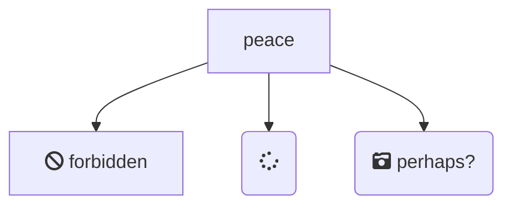

---

title: Mermaid使用简单入门
author: 赵旭山
tags: 杂谈 Markdown Mermaid
typora-root-url: ..
mermaid: true

---


捣鼓了快一天，jekyll渲染Mermaid还是没有成功，先放一放...

[8127. Jekyll - Diagram with Mermaid](https://jojozhuang.github.io/tutorial/jekyll-diagram-with-mermaid/)

[Tech：GitHub Pages + Jekyll + Mermaid](https://chenqi.app/github-pages-jekyll-mermaid-async/)

## 1. 什么是Mermaid？

&emsp;&emsp;Mermaid是一种基于Javascript的绘图工具，使用类似于Markdown的语法，使用户可以方便快捷地通过代码创建图表。

- Mermaid可以绘制以下图表：

  - Flowchart，流程图，使用`graph`关键字；
  - Sequence Diagram，序列图，使用`sequenceDiagram`关键字；

  - Class Diagram，类图，使用`classDiagram`关键字；

  - State Diagram，状态图，使用`stateDiagram`关键字；

  - Entity Relationship Diagram，实体关系图，使用`erDiagram`关键字；

  - User Journey，用户行程图，使用`journey`关键字；

  - Gantt，甘特图，使用`gantt`关键字；

  - Pie Chart，饼状图，使用`pie`关键字；

  - Requirement Diagram，需求图，使用`requirementDiagram`关键字；

  - Gitgraph(Git) Diagram，git分支图，使用`gitGraph`关键字；

## 2. Flowchart，流程图

```
graph TD;
		A-->B;
		A-->C;
		B-->D;
		C-->D;
```





## References

[Mermaid从入门到入土——Markdown进阶语法](https://zhuanlan.zhihu.com/p/355997933)

[Mermaid从入门到入土](https://www.jianguoyun.com/p/Dfun4HUQlP2vCRiC7vwD)

[Mermaid document](https://mermaid-js.github.io/mermaid)

[Mermaid 实用教程](https://blog.csdn.net/fenghuizhidao/article/details/79440583)

[Mermaid：如何在Markdown文本中添加流程图，附支持github的方法](https://blog.csdn.net/weixin_43661154/article/details/112101437)