## 目录

[TOC]

***

捣鼓了快一天，jekyll渲染Mermaid还是没有成功，只认识`graph`关键字，先放一放...

[8127. Jekyll - Diagram with Mermaid](https://jojozhuang.github.io/tutorial/jekyll-diagram-with-mermaid/)

[Tech：GitHub Pages + Jekyll + Mermaid](https://chenqi.app/github-pages-jekyll-mermaid-async/)

目前暂时的解决方案，把该Markdown整体导出为`html`再发布。

## 1. 什么是Mermaid？

&emsp;&emsp;Mermaid是一种基于Javascript的绘图工具，使用类似于Markdown的语法，使用户可以方便快捷地通过代码创建图表。

- Mermaid可以绘制以下图表：

  - Flowchart，流程图，使用`graph`关键字；
  - Sequence Diagram，序列图，使用`sequenceDiagram`关键字；

  - Class Diagram，类图，使用`classDiagram`关键字；

  - State Diagram，状态图，使用`stateDiagram`关键字；

  - Entity Relationship Diagram，实体关系图，使用`erDiagram`关键字；

  - User Journey，用户行程图，使用`journey`关键字；

  - Gantt，甘特图，使用`gantt`关键字；

  - Pie Chart，饼状图，使用`pie`关键字；

  - Requirement Diagram，需求图，使用`requirementDiagram`关键字；

  - Gitgraph(Git) Diagram，git分支图，使用`gitGraph`关键字；

## 2. Flowchart，流程图
&emsp;&emsp;所有流程图都由节点、几何形状和边缘、箭头或线条组成。Mermaid定义了这些节点和边的制作和交互方式。还可以定义不同的箭头类型、多向箭头以及与子图的链接。

> *重要提示*：不要将单词“end”键入为流程图节点。将所有或任何一个字母大写以防止流程图被中断，例如“End”或“END”。
```
flowchart TD
  start --> state
  state --> END
```

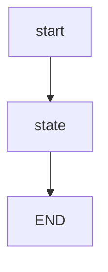
> 当然，如果你非要生成一个名字叫“end”节点，也不是没有解决方案。

```
flowchart TD
  start --> state
  state --> endnode["end"]
```
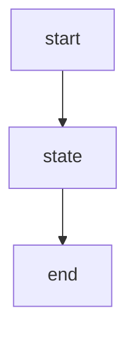
### 2.1 Node节点

#### 2.1.1 默认Node

```
flowchart LR
		id
```

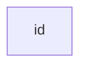

> *注*：此“id”就是框中展示的内容。

#### 2.1.2带有文字的Node

```
flowchart LR
		id1[This is the text in the box]
```

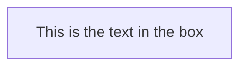

### 2.2 Flowchart方向

* TB - top to bottom
* TD - top-down/ same as top to bottom
* BT - bottom to top
* RL - right to top
* RL - right to left
* LR - left to right

```
flowchart TD
		Start --> Stop
```

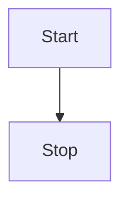

```
flowchart LR
		Start --> Stop
```

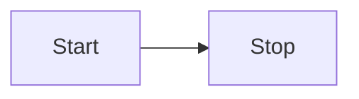
### 2.3 Node节点形状
```
flowchart TB
	id1(圆角矩形) -->
	id2([体育场形]) -->
	id3[[子程序]] -->
	id4[(圆柱形)]
	id5((圆形)) -->
	id6>非对称燕尾形] -->
	id7{菱形} -->
	id8{{六角形}}
	id9[/平行四边形/] -->
	id10[\反向平行四边形\] -->
	id11[/梯形\] -->
	id12[\反向梯形/]
```

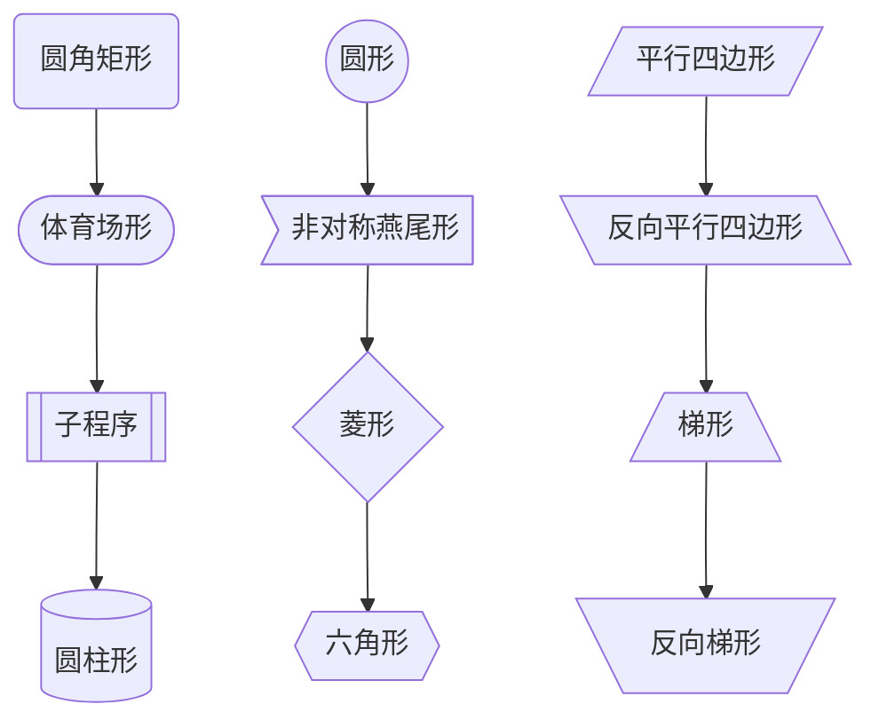

### 2.4 Node节点之间连接

箭头连接

```
flowchart LR
		A-->B
```


连线

```
flowchart LR
		A --- B
```

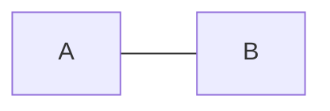

带文字的连接

```
flowchart LR
		A -- This is the text! ---B
```

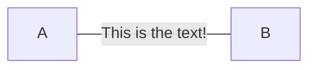

​	带文字的箭头连接

```
flowchart LR
		A --> |text|B
```

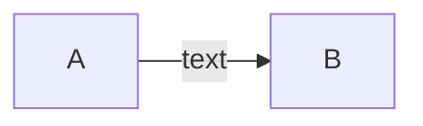

虚点连接

```
flowchart LR
		A -.-> B
```

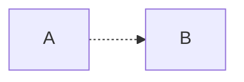

带文字的虚点连接

```
flowchart LR
		A -. text .-> B
```

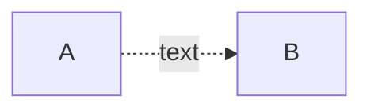

粗连接

```
flowchart LR
		A ==> B
```

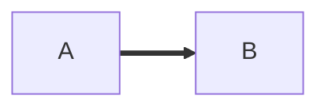

带文字的粗连接

```
flowchart LR
		A == text ==> B
```

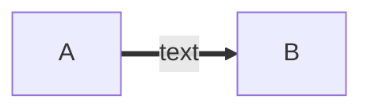

连接串

```
flowchart LR
		A -- text --> B -- text2 --> C
```

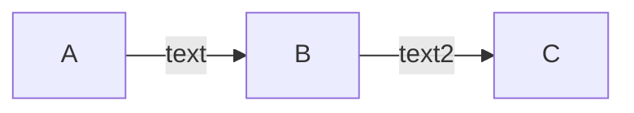

```
flowchart LR
		a --> b & c --> d
```

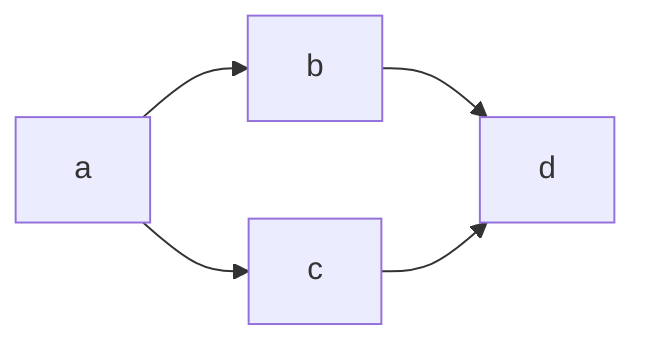

```
flowchart TB
		A & B --> C & D
```

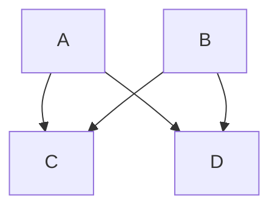

或者：

```
flowchart TB
		A --> C
		A --> D
		B --> C
		B --> D
```


### 2.5 新箭头类型

```
flowchart LR
		A --o B
		B --x C
```

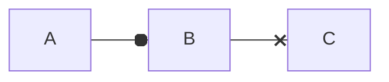

### 2.6 多向箭头

```
flowchart LR
		A o--o B
		B <--> C
		C x--x D
```

```mermaid
flowchart LR
		A o--o B
		B <--> C
		C x--x D
```

```
flowchart TD
		A[Start] --> B{Is it?}
		B --> |Yes| C[OK]
		C --> D[Rethink]
		D --> B
		B ----> |No| E[End]
```

```mermaid
flowchart TD
		A[Start] --> B{Is it?}
		B --> |Yes| C[OK]
		C --> D[Rethink]
		D --> B
		B ----> |No| E[End]
```

```
flowchart TD
		A[Start] --> B{Is it?}
		B -- Yes --> C[OK]
		C --> D[Rethink]
		D --> B
		B -- No ----> E[End]
```

```mermaid
flowchart TD
		A[Start] --> B{Is it?}
		B -- Yes --> C[OK]
		C --> D[Rethink]
		D --> B
		B -- No ----> E[End]
```


## References

[Mermaid从入门到入土——Markdown进阶语法](https://zhuanlan.zhihu.com/p/355997933)

[Mermaid从入门到入土](https://www.jianguoyun.com/p/Dfun4HUQlP2vCRiC7vwD)

[Mermaid document](https://mermaid-js.github.io/mermaid)

[Mermaid 实用教程](https://blog.csdn.net/fenghuizhidao/article/details/79440583)

[Mermaid：如何在Markdown文本中添加流程图，附支持github的方法](https://blog.csdn.net/weixin_43661154/article/details/112101437)