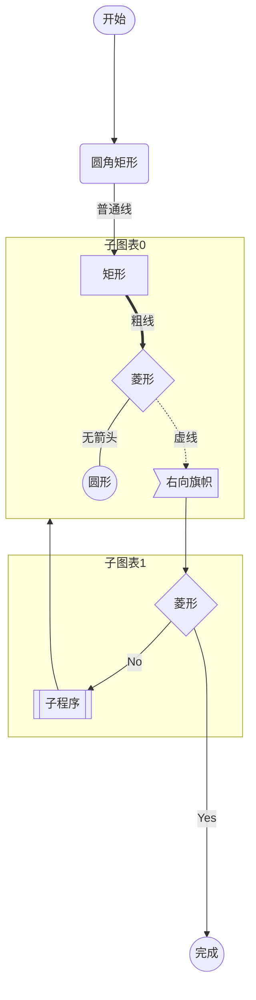
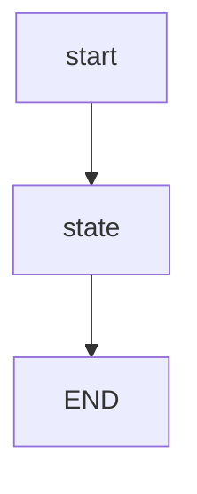
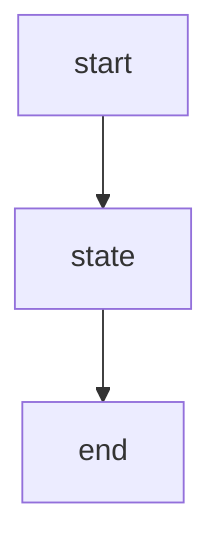
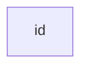
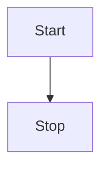
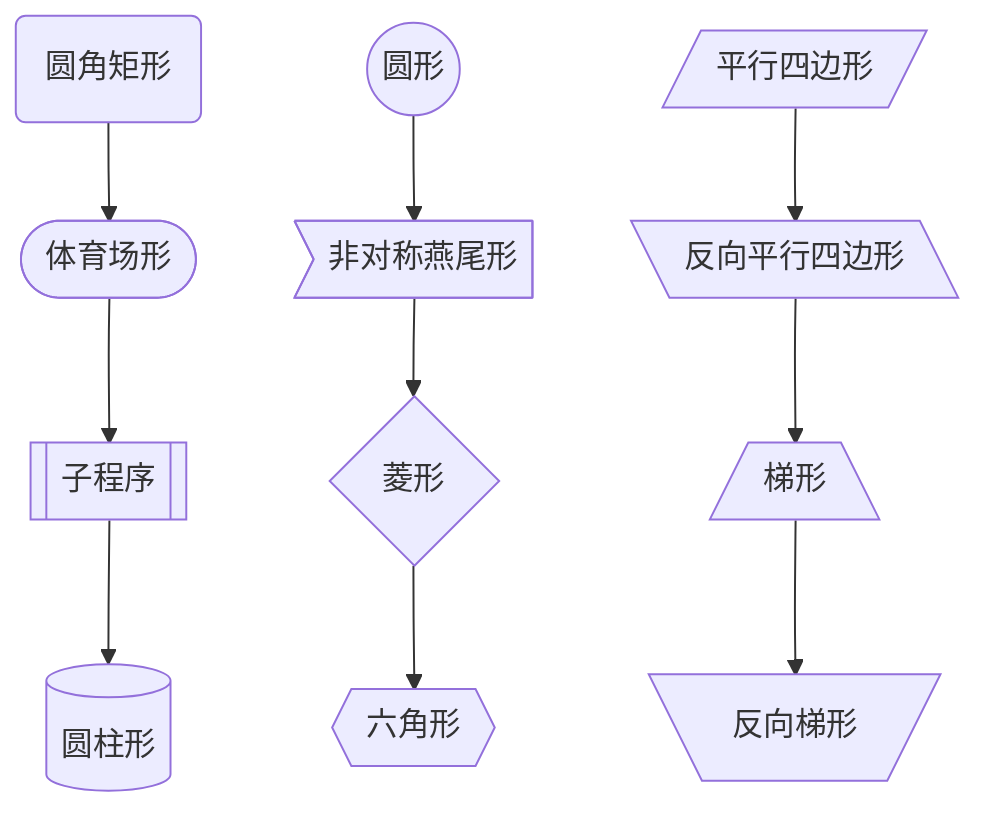
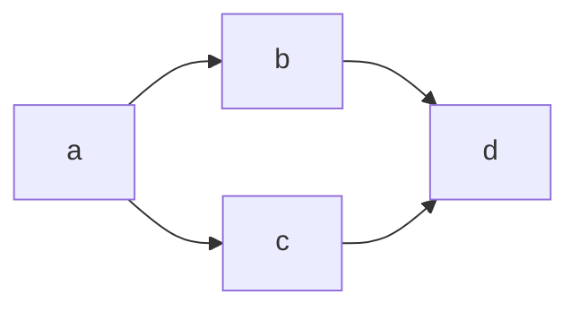
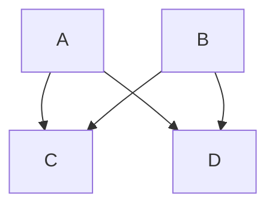

## 目录

[TOC]

***

捣鼓了快一天，jekyll渲染Mermaid还是没有成功，只认识`graph`关键字，先放一放...

[8127. Jekyll - Diagram with Mermaid](https://jojozhuang.github.io/tutorial/jekyll-diagram-with-mermaid/)

[Tech：GitHub Pages + Jekyll + Mermaid](https://chenqi.app/github-pages-jekyll-mermaid-async/)

目前暂时的解决方案，把该Markdown整体导出为`html`再发布。

## 1. 什么是Mermaid？

&emsp;&emsp;Mermaid是一种基于Javascript的绘图工具，使用类似于Markdown的语法，使用户可以方便快捷地通过代码创建图表。

- Mermaid可以绘制以下图表：

  - Flowchart，流程图，使用`graph`关键字；
  - Sequence Diagram，序列图，使用`sequenceDiagram`关键字；

  - Class Diagram，类图，使用`classDiagram`关键字；

  - State Diagram，状态图，使用`stateDiagram`关键字；

  - Entity Relationship Diagram，实体关系图，使用`erDiagram`关键字；

  - User Journey，用户行程图，使用`journey`关键字；

  - Gantt，甘特图，使用`gantt`关键字；

  - Pie Chart，饼状图，使用`pie`关键字；

  - Requirement Diagram，需求图，使用`requirementDiagram`关键字；

  - Gitgraph(Git) Diagram，git分支图，使用`gitGraph`关键字；

&emsp;&emsp;先看一个示例效果图：



## 2. Flowchart，流程图

&emsp;&emsp;所有流程图都由节点、几何形状和边缘、箭头或线条组成。Mermaid定义了这些节点和边的制作和交互方式。还可以定义不同的箭头类型、多向箭头以及与子图的链接。

> *重要提示*：不要将单词“end”键入为流程图节点。将所有或任何一个字母大写以防止流程图被中断，例如“End”或“END”。
```
flowchart TD
  start --> state
  state --> END
```


> 当然，如果你非要生成一个名字叫“end”节点，也不是没有解决方案。

```
flowchart TD
  start --> state
  state --> endnode["end"]
```

### 2.1 Node节点

#### 2.1.1 默认Node

```
flowchart LR
		id
```



> *注*：此“id”就是框中展示的内容。

#### 2.1.2带有文字的Node

```
flowchart LR
		id1[This is the text in the box]
```


### 2.2 Flowchart方向

* TB - top to bottom
* TD - top-down/ same as top to bottom
* BT - bottom to top
* RL - right to top
* RL - right to left
* LR - left to right

```
flowchart TD
		Start --> Stop
```



```
flowchart LR
		Start --> Stop
```


### 2.3 Node节点形状
```
flowchart TB
	id1(圆角矩形) -->
	id2([体育场形]) -->
	id3[[子程序]] -->
	id4[(圆柱形)]
	id5((圆形)) -->
	id6>非对称燕尾形] -->
	id7{菱形} -->
	id8{{六角形}}
	id9[/平行四边形/] -->
	id10[\反向平行四边形\] -->
	id11[/梯形\] -->
	id12[\反向梯形/]
```



### 2.4 Node节点之间连接

箭头连接

```
flowchart LR
		A-->B
```


连线

```
flowchart LR
		A --- B
```


带文字的连接

```
flowchart LR
		A -- This is the text! ---B
```


​	带文字的箭头连接

```
flowchart LR
		A --> |text|B
```


虚点连接

```
flowchart LR
		A -.-> B
```


带文字的虚点连接

```
flowchart LR
		A -. text .-> B
```


粗连接

```
flowchart LR
		A ==> B
```


带文字的粗连接

```
flowchart LR
		A == text ==> B
```


连接串

```
flowchart LR
		A -- text --> B -- text2 --> C
```


```
flowchart LR
		a --> b & c --> d
```



```
flowchart TB
		A & B --> C & D
```



或者：

```
flowchart TB
		A --> C
		A --> D
		B --> C
		B --> D
```


### 2.5 新箭头类型

```
flowchart LR
		A --o B
		B --x C
```

```mermaid
flowchart LR
		A --o B
		B --x C
```

### 2.6 多向箭头

```
flowchart LR
		A o--o B
		B <--> C
		C x--x D
```

```mermaid
flowchart LR
		A o--o B
		B <--> C
		C x--x D
```
### 2.7 连接长度

&emsp;&emsp;可以通过在连接线定义中添加额外的破折线，以使该连接线比其他连接线更长。下面的例子中，节点`B{Is it?}`到节点`E[End]`的连接线`-->`添加了两个额外的破折号`---->`。

```
flowchart TD
		A[Start] --> B{Is it?}
		B --> |Yes| C[OK]
		C --> D[Rethink]
		D --> B
		B ----> |No| E[End]
```
```mermaid
flowchart TD
		A[Start] --> B{Is it?}
		B --> |Yes| C[OK]
		C --> D[Rethink]
		D --> B
		B ----> |No| E[End]
```
&emsp;&emsp;如果加长的连接线需要带文字，那么额外的破折线需要放在文字右边，如下示例。
```
flowchart TD
		A[Start] --> B{Is it?}
		B -- Yes --> C[OK]
		C --> D[Rethink]
		D --> B
		B -- No ----> E[End]
```

```mermaid
flowchart TD
		A[Start] --> B{Is it?}
		B -- Yes --> C[OK]
		C --> D[Rethink]
		D --> B
		B -- No ----> E[End]
```

&emsp;&emsp;对于虚点连接和粗连接，需要添加的字符是`.`和`=`，添加方法汇总如下：
| Length | 1 | 2 | 3 |
| :---: | :---: | :---: | :---: |
| Normal | `---` | `----` | `-----`|
| Normal with arrow | `-->` | `--->` | `---->` |
| Thick | `===` | `====` | `=====` |
| Thick with arrow | `==>` | `===>` | `====>` |
| Dotted | `-.-` | `-..-` | `-...-` |
| Dotted with arrow | `-.->` | `-..->` | `-...->` |

### 2.8 特殊字符嵌入

&emsp;&emsp;可以将文本放置于引号`"quotes"`内，包括特殊字符。如下所示：

```
flowchart LR
		id1["This is the (text) in the box"]
```

```mermaid
flowchart LR
		id1["This is the (text) in the box"]
```

**转义字符**

可以使用以下示例的语法来转义字符。

```
flowchart LR
		A["A double quote: #quot;"] --> B["A dec char: #9829;"]
```

```mermaid
flowchart LR
		A["A double quote: #quot;"] --> B["A dec char: #9829;"]
```

给出的数字是以 10 为基数，因此 # 可以编码为 #35;。还支持使用 HTML 字符名称。

`#35;`: #

`#70;`:  F

```mermaid
flowchart TD
		A["#35;"]
		B["#70;"]
```

### 2.9 子图

&emsp;&emsp;定义子图的语法：

```
subgraph title
		graph definition
end
```

示例如下：

```
flowchart TB
		c1-->a2
		subgraph one
				a1-->a2
		end
		subgraph two
				b1-->b2
		end
		subgraph three
				c1-->c2
		end
```

```mermaid
flowchart TB
		c1-->a2
		subgraph one
				a1-->a2
		end
		subgraph two
				b1-->b2
		end
		subgraph three
				c1-->c2
		end
```

除设置子图名称（title）外，也可以给子图设置一个显式id。

```
flowchart TB
		c1-->a2
		subgraph ide1 [one]
				a1-->a2
		end
```

```mermaid
flowchart TB
		c1-->a2
		subgraph ide1 [One]
				a1-->a2
		end
```

流程图中，也可以把整个子图作为连接线的起始点或目标点，如下所示：

```
flowchart TB
		c1-->a2
		subgraph one
				a1-->a2
		end
		subgraph two
				b1-->b2
		end
		subgraph three
				c1-->c2
		end
		one-->two
		three-->two
		two-->c2
```

```mermaid
flowchart TB
		c1-->a2
		subgraph one
				a1-->a2
		end
		subgraph two
				b1-->b2
		end
		subgraph three
				c1-->c2
		end
		one-->two
		three-->two
		two-->c2
```

&emsp;&emsp;流程图中，可以使用方向语句来设置子图将呈现的方向，如下例所示：

```
flowchart LR
		subgraph TOP
				direction TB
				subgraph B1
						direction RL
						i1-->f1
				end
				subgraph B2
						direction BT
						i2-->f2
				end
		end
		A-->TOP-->B
		B1-->B2
```

```mermaid
flowchart LR
		subgraph TOP
				direction TB
				subgraph B1
						direction RL
						i1-->f1
				end
				subgraph B2
						direction BT
						i2-->f2
				end
		end
		A-->TOP-->B
		B1-->B2
```

### 2.10 注释

&emsp;&emsp;可以在流程图中输入注释，解析器将忽略这些注释。注释需要单独一行，并且必须以 %%（双百分号）开头。注释开始后到下一个换行符的任何文本都将被视为注释，包括任何工作流语法，

```
flowchart LR
%% this is a comment A -- text --> B{node}
		A -- text --> B{node} -- text2 --> C
```

```mermaid
flowchart LR
%% this is a comment A -- text --> B{node}
		A -- text --> B{node} -- text2 --> C
```

### 2.11 样式和类

#### 2.11.1 连接样式

&emsp;&emsp;连接线可以设置样式，例如如果想要对工作流中向后的链接进行样式设置，由于连接线没有与节点相同的 id，因此需要其他方式来确定连接线应添加哪种样式。使用图表中定义连接线时的序号代替 id。

&emsp;&emsp;在下面的示例中，linkStyle 语句中定义的样式将属于图中的第4个链接：

```
linkStyle 3 stroke:#ff3,stroke-width:4px,color:red;
```

```
flowchart TB
		c1-->a2
		subgraph one
				a1-->a2
		end
		subgraph two
				b1-->b2
		end
		subgraph three
				c1--text-->c2
		end
		linkStyle 3 stroke:#ff7f00,stroke-width:4px,color:blue;
```

```mermaid
flowchart TB
		c1-->a2
		subgraph one
				a1-->a2
		end
		subgraph two
				b1-->b2
		end
		subgraph three
				c1--text-->c2
		end
		linkStyle 3 stroke:#ff7f00,stroke-width:4px,color:blue;
```

第**4**条连接线（`c1-->c2`）被添加了样式，`color`定义了连接线上文字的颜色。一些颜色的十六进制色码表示如下：

```
flowchart TB
		id1((白色))
		id2((墨绿))
		id3((巧克力色))
		id4((青铜色))
		id5((珊瑚色))
		style id1 fill:#ffffff
		style id2 fill:#00ffff
		style id3 fill:#5c3317,color:#ffffff
		style id4 fill:#8c7853
		style id5 fill:#ff7f00
```


```mermaid
flowchart TB
		id1((白色))
		id2((墨绿))
		id3((巧克力色))
		id4((青铜色))
		id5((珊瑚色))
		style id1 fill:#ffffff
		style id2 fill:#00ffff
		style id3 fill:#5c3317,color:#ffffff
		style id4 fill:#8c7853
		style id5 fill:#ff7f00
```


> 常用颜色代码：
> | **No.** |   **颜色**   | **十六进制颜色码** |
> | :-----: | :----------: | :----------------: |
> |    1    |     白色     |    FFFFFF     |
> |    2    |     红色     |    FF0000     |
> |    3    |     绿色     |    00FF00     |
> |    4    |     蓝色     |    0000FF     |
> |    5    |    牡丹红    |    FF00FF     |
> |    6    |     青色     |    00FFFF     |
> |    7    |     黄色     |    FFFF00     |
> |    8    |     黑色     |    000000     |
> |    9    |     海蓝     |    70DB93     |
> |   10    |   巧克力色   |    5C3317     |
> |   11    |    蓝紫色    |    9F5F9F     |
> |   12    |    黄铜色    |    B5A642     |
> |   13    |    亮金色    |    D9D919     |
> |   14    |     棕色     |    A67D3D     |
> |   15    |    青铜色    |    8C7853     |
> |   16    |  2号青铜色   |    A67D3D     |
> |   17    |  士官服蓝色  |    5F9F9F     |
> |   18    |    冷铜色    |    D98719     |
> |   19    |     铜色     |    B87333     |
> |   20    |    珊瑚红    |    FF7F00     |
> |   21    |    紫蓝色    |    42426F     |
> |   22    |     深棕     |    5C4033     |
> |   23    |     深绿     |    2F4F2F     |
> |   24    |   深铜绿色   |    4A766E     |
> |   25    |   深橄榄绿   |    4F4F2F     |
> |   26    |   深兰花色   |    9932CD     |
> |   27    |    深紫色    |    871F78     |
> |   28    |   深石板蓝   |    6B238E     |
> |   29    |   深铅灰色   |    2F4F4F     |
> |   30    |   深棕褐色   |    97694F     |
> |   32    |  深绿松石色  |    7093DB     |
> |   33    |    暗木色    |    855E42     |
> |   34    |    淡灰色    |    545454     |
> |   35    | 土灰玫瑰红色 |    545454     |
> |   36    |    长石色    |    D19275     |
> |   37    |    火砖色    |    8E2323     |
> |   38    |    森林绿    |    238E23     |
> |   39    |     金色     |    CD7F32     |
> |   40    |    鲜黄色    |    DBDB70     |
> |   41    |     灰色     |    C0C0C0     |
> |   42    |    铜绿色    |    527F76     |
> |   43    |    青黄色    |    93DB70     |
> |   44    |    猎人绿    |    215E21     |
> |   45    |    印度红    |    4E2F2F     |
> |   46    |    土黄色    |    9F9F5F     |
> |   47    |    浅蓝色    |    C0D9D9     |
> |   48    |    浅灰色    |    A8A8A8     |
> |   49    |   浅钢蓝色   |    8F8FBD     |
> |   59    |    浅木色    |    E9C2A6     |
> |   60    |   石灰绿色   |    32CD32     |
> |   61    |    桔黄色    |    E47833     |
> |   62    |    褐红色    |    8E236B     |
> |   63    |   中海蓝色   |    32CD99     |
> |   64    |    中蓝色    |    3232CD     |
> |   65    |   中森林绿   |    6B8E23     |
> |   66    |   中鲜黄色   |    EAEAAE     |
> |   67    |   中兰花色   |    9370DB     |
> |   68    |   中海绿色   |    426F42     |
> |   69    |  中石板蓝色  |    7F00FF     |
> |   70    |   中春绿色   |    7FFF00     |
> |   71    |  中绿松石色  |    70DBDB     |
> |   72    |   中紫红色   |    DB7093     |
> |   73    |    中木色    |    A68064     |
> |   74    |   深藏青色   |    2F2F4F     |
> |   75    |    海军蓝    |    23238E     |
> |   76    |    霓虹篮    |    4D4DFF     |
> |   77    |   霓虹粉红   |    FF6EC7     |
> |   78    |  新深藏青色  |    00009C     |
> |   79    |   新棕褐色   |    EBC79E     |
> |   80    |   暗金黄色   |    CFB53B     |
> |   81    |     橙色     |    FF7F00     |
> |   82    |    橙红色    |    FF2400     |
> |   83    |    淡紫色    |    DB70DB     |
> |   84    |    浅绿色    |    8FBC8F     |
> |   85    |    粉红色    |    BC8F8F     |
> |   86    |    李子色    |    EAADEA     |
> |   87    |    石英色    |    D9D9F3     |
> |   88    |    艳蓝色    |    5959AB     |
> |   89    |    鲑鱼色    |    6F4242     |
> |   90    |    猩红色    |    BC1717     |
> |   91    |    海绿色    |    238E68     |
> |   92    | 半甜巧克力色 |    6B4226     |
> |   93    |     赭色     |    8E6B23     |
> |   94    |     银色     |    E6E8FA     |
> |   95    |     天蓝     |    3299CC     |
> |   96    |    石板蓝    |    007FFF     |
> |   97    |   艳粉红色   |    FF1CAE     |
> |   98    |    春绿色    |    00FF7F     |
> |   99    |    钢蓝色    |    236B8E     |
> |   100   |   亮天蓝色   |    38B0DE     |
> |   101   |    棕褐色    |    DB9370     |
> |   102   |    紫红色    |    D8BFD8     |
> |   103   |   石板蓝色   |    ADEAEA     |
> |   104   |   浓深棕色   |    5C4033     |
> |   105   |   淡浅灰色   |    CDCDCD     |
> |   106   |   紫罗兰色   |    4F2F4F     |
> |   107   |  紫罗兰红色  |    CC3299     |
> |   108   |    麦黄色    |    D8D8BF     |

> ***Convert Excel to Markdown Table**: [https://tableconvert.com/excel-to-markdown](https://tableconvert.com/excel-to-markdown)

#### 2.11.2 节点样式

&emsp;&emsp;可以对节点应用特定样式，例如较粗的边框或不同的背景颜色。

```
flowchart LR
		id1([Start])-->id2((Stop))
		style id1 fill:#38b0de,stroke:#d8d8bf,stroke-width:4px
		style id2 fill:#00ff7f,stroke:#d8bfd8,stroke-width:6px,color:#ff1cae,stroke-dasharray: 5 5
```

```mermaid
flowchart LR
		id1([Start])-->id2((Stop))
		style id1 fill:#38b0de,stroke:#d8d8bf,stroke-width:4px
		style id2 fill:#00ff7f,stroke:#d8bfd8,stroke-width:6px,color:#ff1cae,stroke-dasharray: 5 5
```

#### 2.11.3 类

&emsp;&emsp;比每次都定义样式更方便的是定义一个样式类，并附加到需要定义样式的Node节点上。

&emsp;&emsp;类定义如下例所示：

```
classDef className fill:#f9f,stroke:#333,stroke-width:4px;
```

将类附加到节点按以下方式完成：

```
class nodeId1 className;
```

也可以在一个语句中将一个类附加到节点列表：

```
class nodeId1,nodeId2 className;
```

&emsp;&emsp;一个完整的示例如下：

```
flowchart LR
		nodeId1-->nodeId2-->nodeId3
		classDef className0 fill:#f9f,stroke:#333,stroke-width:4px;
		classDef className1 fill:#8E6B23,stroke:#93DB70,stroke-width:10px,color:white,stroke-dasharray: 5 5;
		class nodeId1,nodeId2 className0;
		class nodeId3 className1;
```

```mermaid
flowchart LR
		nodeId1-->nodeId2-->nodeId3
		classDef className0 fill:#f9f,stroke:#333,stroke-width:4px;
		classDef className1 fill:#8e6b23,stroke:#93db70,stroke-width:10px,color:white,stroke-dasharray:5 5;
		class nodeId1,nodeId2 className0;
		class nodeId3 className1;
```

&emsp;&emsp;添加类的更简短形式是使用 `:::operator` 将类名附加到节点，如下所示：

```
flowchart LR
		A:::someclass --> B
		classDef someclass fill:#f96
```

```mermaid
flowchart LR
		A:::someclass --> B
		classDef someclass fill:#f96
```
#### 2.11.4 默认类
如果一个类被命名为`default`，它将被分配给所有没有特别定义的类。

```
classDef default fill:#f9f,stroke:#333,stroke-width:4px;
```
```
flowchart LR
		id1([Start])-->id2-->id3{if...else}
		id3--yes-->id4((End))
		id3--No-->id2
		classDef default fill:#f9f,stroke:#333,stroke-width:4px
```
```mermaid
flowchart LR
		id1([Start])-->id2-->id3{if...else}
		id3--yes-->id4((End))
		id3--No-->id2
		classDef default fill:#f9f,stroke:#333,stroke-width:4px
```

