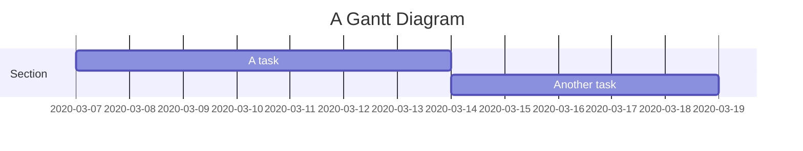
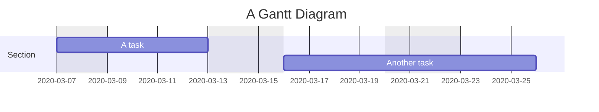
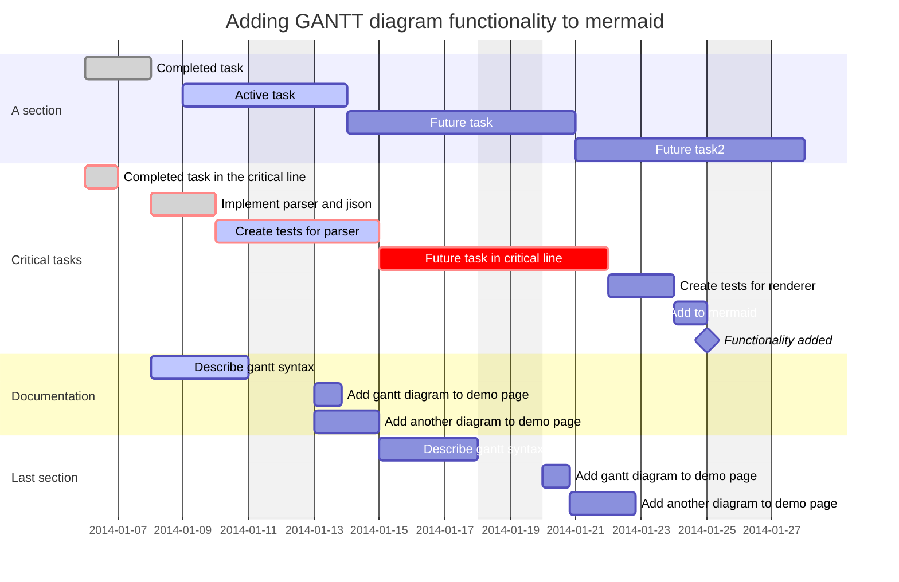
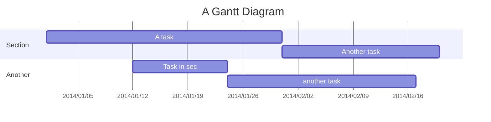

&emsp;&emsp;甘特图是一种条形图，最初由 Karol Adamiecki 于 1896 年开发，并由 Henry Gantt 在 1910 年代独立开发，它展示了项目进度和完成所需的时间，以及各子任务的开始日期、结束日期及之间的天数。
## 1. 简介

&emsp;&emsp;甘特图将每个计划任务记录为一个从左向右延伸的连续条形图， *x* 轴代表时间，*y* 轴记录不同的任务及其完成的顺序。

&emsp;&emsp;一个简单的示例如下：

```
gantt
		title A Gantt Diagram
		dateFormat YYYY-MM-DD
		excludes 2020-3-16, 2020-3-18, 2020-3-19
		section Section
		
		A task: a1, 2020-03-07, 7d
		Another task: after a1, 5d
```



&emsp;&emsp;但是，如果排除的日期介于两个设置为连续开始的任务之间，则排除的日期将以图形方式跳过并留空，并且以下任务将在排除的日期结束后开始。如下所示：

```
gantt
		title A Gantt Diagram
		dateFormat YYYY-MM-DD
		excludes	Sunday, Friday, Saturday
		section Section
		
		A task: a1, 2020-03-07, 5d
		Another task: after a1, 7d
```



&emsp;&emsp;甘特图可用于跟踪项目完成之前所需的时间，但它也可用于以图形方式表示“非工作日”，只需进行一些调整。

```
gantt
		title A Gantt Diagram
		dateFormat YYYY-MM-DD
		section Section
		A task: a1, 2014-01-01, 30d
		Another task: after a1, 20d
		section Another
		Task in sec: 2014-01-12, 12d
		another task: 24d
```


## 2. 语法

```
gantt
		dateFormat YYYY-MM-DD
		title Adding GANTT diagram functionality to mermaid
		excludes weekends
		%% (`excludes` accepts specific dates in YYYY-MM-DD format, days of the week ("sunday") or "weekends", but not the word "weekdays".)
		
		section A section
		Completed task: done, des1, 2014-01-06, 2014-01-08
		Active task: active, des2, 2014-01-09, 3d
		Future task: des3, after des2, 5d
		Future task2: des4, after des3, 5d
		
		section Critical tasks
		Completed task in the critical line: crit, done, 2014-01-06, 24h
		Implement parser and jison: crit, done, after des1, 2d
		Create tests for parser: crit, active, 3d
		Future task in critical line: crit, 5d
		Create tests for renderer: 2d
		Add to mermaid: 1d
		Functionality added: milestone, 2014-01-25, 0d
		
		section Documentation
		Describe gantt syntax: active, a1, after des1, 3d
		Add gantt diagram to demo page: after a1, 20h
		Add another diagram to demo page: doc1, after a1, 48h
		
		section Last section
		Describe gantt syntax: after doc1, 3d
		Add gantt diagram to demo page: 20h
		Add another diagram to demo page: 48h
```



### 2.1 Milestones（里程碑）

&emsp;&emsp;里程碑可以添加到图表中，里程碑与任务不同，因为它代表一个单一的时间瞬间，并由关键字`milestone`标识。以下是`milestone`使用示例，里程碑的确切位置由里程碑的初始日期和任务的”持续时间决定“：初始日期+持续时间/2。

```mermaid
gantt
		dateFormat HH:mm
		axisFormat %H:%M
		Initial milestone: milestone, m1, 17:49, 2min
		taska2: 10min
		taska3: 5min
		Final milestone: milestone, m2, 18:14, 2min
```



### 2.2 时间设置

&emsp;&emsp; `dateFormat`定义了甘特图的日期输入格式，这些日期在渲染图表输出中的表示方式由`axisFormat`定义。

#### 2.2.1 输入时间格式

&emsp;&emsp;默认输入日期格式为 YYYY-MM-DD，也可以定义自定义的日期格式。

```
dataFormat YYYY-MM-DD
```

&emsp;&emsp;时间输入支持如下格式：

| Input | Example | Description |
| :-----: | :-------: | ----------- |
| YYYY  | 2014 | 4位数年份 |
| YY | 14 | 2位数年份 |
| Q | 1..4 | 一年中的季度。将月份设置为季度的第一个月。 |
| M MM | 1..12 | 月份序号 |
| MMM MMM | January..Dec | 由moment.locale()设置的语言环境中的月份名称 |
| D DD | 1..31 | 某月中某天 |
| Do | 1st..31st | 某月中的某天，序数形式 |
| X | 1410715640.579 | Unix时间戳 |
| x | 1410715640579 | Unix毫秒时间戳 |
| H HH | 0..23 | 24小时制时间 |
| h hh | 1..12 | 12小时制时间，以a A标识 |
| a A | am pm | 中午之后或之前 |
| m mm | 0..59 | 分钟 |
| s ss | 0..59 | 秒 |
| S | 0..9 | 十分之一秒 |
| SS | 0..99 | 百分之一秒 |
| SSS | 0..999 | 千分之一秒 |
| Z ZZ | +12:00 | 从 UTC 偏移为 +-HH:mm、+-HHmm 或 Z |

#### 2.2.2 坐标轴上的输出时间格式

&emsp;&emsp;默认输出格式为`YYYY-MM-DD`，可使用`axisFormat`进行自定义，例如`2020-Q1`表示2020年第一季度。

```
axisFormat %Y-%m-%d
```

支持以下格式字符串：

> %a - 缩写的工作日名称；
>
> %A - 完整的工作日名称；
>
> %b - 缩写的月份名称；
>
> %B - 完整的月份名称；
>
> %c - 日期和时间，如“%a %b %e %H:%M:%S %Y”；
>
> %d - 某个月中的日期，零补全，十进制数 [01,31]；
>
> %e - 以十进制数表示的以空格填充的月份日期 [1,31]；等效于 %_d；
>
> %H - 小时（24 小时制），十进制数 [00,23]；
>
> %I - 小时（12 小时制），十进制数 [01,12]；
>
> %j - 一年中的一天，十进制数 [001,366]；
>
> %m - 以十进制数表示的月份 [01,12]；
>
> %M - 分钟，十进制数 [00,59]；
>
> %L - 毫秒，十进制数 [000, 999]；
>
> %p - 上午或下午；
>
> %S - 秒为十进制数 [00,61]；
>
> %U - 一年中的周数（星期日作为一周的第一天），十进制数 [00,53]；
>
> %w - 工作日为十进制数 [0(Sunday),6]；
>
> %W - 一年中的周数（星期一作为一周的第一天），十进制数 [00,53]；
>
> %x - 日期，如“%m/%d/%Y”；
>
> %X - 时间，如“%H:%M:%S”；
>
> %y - 没有世纪的年份作为十进制数 [00,99]；
>
> %Y - 年份，世纪为十进制数；
>
> %Z - 时区偏移量，例如“-0700”；
>
> %% - 文字“%”字符。

### 2.3 注释

&emsp;&emsp;可以在甘特图中输入注释，解析器将忽略这些注释。注释需要单独一行，并且必须以 %%（双百分号）开头。注释开始后到下一个换行符的任何文本都将被视为注释，包括任何图表语法。



