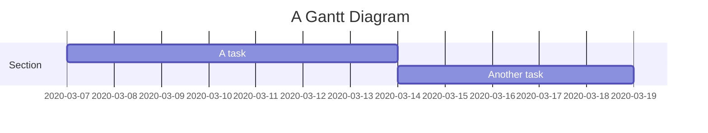
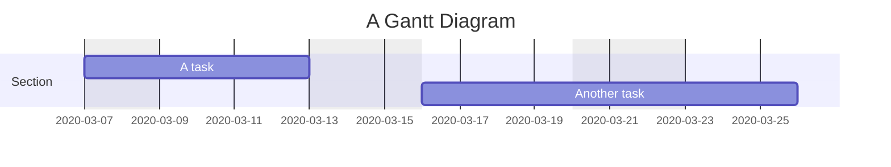
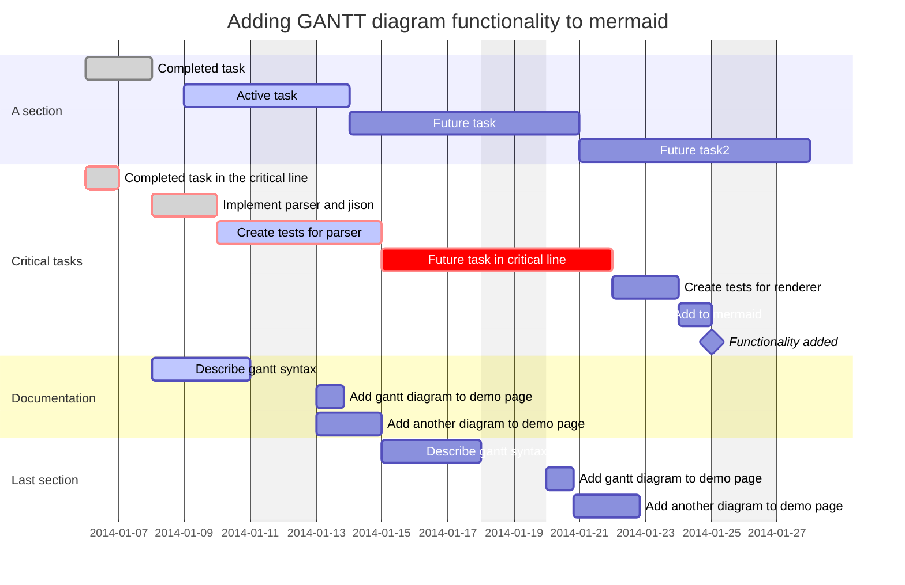

&emsp;&emsp;甘特图是一种条形图，最初由 Karol Adamiecki 于 1896 年开发，并由 Henry Gantt 在 1910 年代独立开发，它展示了项目进度和完成所需的时间，以及各子任务的开始日期、结束日期及之间的天数。
## 1. 简介
&emsp;&emsp;甘特图将每个计划任务记录为一个从左向右延伸的连续条形图， *x* 轴代表时间，*y* 轴记录不同的任务及其完成的顺序。

&emsp;&emsp;一个简单的示例如下：

```
gantt
		title A Gantt Diagram
		dateFormat YYYY-MM-DD
		excludes 2020-3-16, 2020-3-18, 2020-3-19
		section Section
		
		A task: a1, 2020-03-07, 7d
		Another task: after a1, 5d
```



&emsp;&emsp;但是，如果排除的日期介于两个设置为连续开始的任务之间，则排除的日期将以图形方式跳过并留空，并且以下任务将在排除的日期结束后开始。如下所示：

```
gantt
		title A Gantt Diagram
		dateFormat YYYY-MM-DD
		excludes	Sunday, Friday, Saturday
		section Section
		
		A task: a1, 2020-03-07, 5d
		Another task: after a1, 7d
```



&emsp;&emsp;甘特图可用于跟踪项目完成之前所需的时间，但它也可用于以图形方式表示“非工作日”，只需进行一些调整。


## 2. 语法



